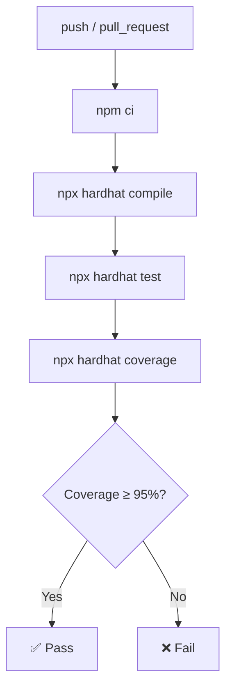

# Decentralized Social Lending — 実装計画（PR 単位）

> **ベース仕様**: [SPEC.md](file:///Volumes/Storage/src/decentralized-social-lending/prompt/SPEC.md)
> **作成日**: 2026-02-11

---

## PR 依存関係

```mermaid
graph LR
    PR01["PR-01: Critical Bug Fix"]
    PR02["PR-02: CI Pipeline"]
    PR03["PR-03: Security Hardening"]
    PR04["PR-04: Gas Optimization"]
    PR05["PR-05: Existing Test Coverage"]
    PR06["PR-06: Grace Period + Liquidation"]
    PR07["PR-07: Credit Score"]
    PR08["PR-08: Loan Offers"]
    PR09["PR-09: Code Quality + Infra"]

    PR01 --> PR02
    PR02 --> PR03
    PR03 --> PR04
    PR04 --> PR05
    PR05 --> PR06
    PR06 --> PR07
    PR07 --> PR08
    PR08 --> PR09
```



---

## PR-01: Critical Bug Fix + ファイル整理

**ブランチ**: `fix/merge-conflict-and-cleanup`
**SPEC 対象**: §1.1, §1.2, §5.4

### 変更内容

| ファイル | 操作 | 内容 |
|---------|------|------|
| `contracts/decentralizedSocialLending.sol` | MODIFY | マージコンフリクトマーカー削除、重複 `getBorrowerLoans` 削除、`pragma solidity 0.8.24;` に固定 |
| `contracts/AggregatorV3Interface.sol` | DELETE | 重複ファイル削除 |
| `contracts/MockV3Aggregator.sol` | DELETE | 未使用モック削除 |
| `contracts/mocks/MockERC20.sol` | MODIFY | `pragma solidity 0.8.24;` に固定 |
| `contracts/mocks/MockPriceFeed.sol` | MODIFY | `pragma solidity 0.8.24;` に固定 |
| `contracts/interfaces/AggregatorV3Interface.sol` | MODIFY | `pragma solidity 0.8.24;` に固定 |

### テスト計画
```bash
npx hardhat compile   # コンパイル成功を確認
npx hardhat test      # 既存テスト全パス
```

### 完了条件
- [ ] コンパイル成功
- [ ] 既存テスト全パス
- [ ] 重複ファイルが削除されていること

---

## PR-02: CI/CD パイプライン構築

**ブランチ**: `feat/ci-pipeline`
**SPEC 対象**: §7.3, §7.4
**前提**: PR-01 マージ済み

### 変更内容

| ファイル | 操作 | 内容 |
|---------|------|------|
| `.github/workflows/ci.yml` | NEW | compile → test → coverage パイプライン |
| `.env.example` | NEW | 環境変数テンプレート |
| `.gitignore` | MODIFY | `.env` を追加（未追加の場合） |

### CI ジョブ定義
```yaml
name: CI
on: [push, pull_request]
jobs:
  test:
    runs-on: ubuntu-latest
    steps:
      - uses: actions/checkout@v4
      - uses: actions/setup-node@v4
        with: { node-version: '20', cache: 'npm' }
      - run: npm ci
      - run: npx hardhat compile
      - run: npx hardhat test
      - run: npx hardhat coverage
      - name: Check coverage thresholds
        run: |
          node -e "
            const r = require('./coverage/coverage-summary.json').total;
            const fail = [];
            if (r.statements.pct < 95) fail.push('Statements: ' + r.statements.pct + '% < 95%');
            if (r.branches.pct < 90) fail.push('Branches: ' + r.branches.pct + '% < 90%');
            if (r.functions.pct < 100) fail.push('Functions: ' + r.functions.pct + '% < 100%');
            if (fail.length) { console.error('Coverage below threshold:\n' + fail.join('\n')); process.exit(1); }
            console.log('All coverage thresholds passed');
          "
```

> [!NOTE]
> Coverage 閾値チェックは `coverage-summary.json` を解析して Statements ≥ 95% / Branches ≥ 90% / Functions = 100% を強制する。閾値未達は CI を fail にする。

### 完了条件
- [ ] CI が GitHub Actions で正常に動作
- [ ] Coverage 閾値チェックステップが機能している
- [ ] `.env.example` が存在
- [ ] PR-02 以降の全 PR で CI が自動実行される

---

## PR-03: セキュリティ強化

**ブランチ**: `feat/security-hardening`
**SPEC 対象**: §2.1, §2.2, §2.4, §2.5
**前提**: PR-02 マージ済み

### 変更内容

| ファイル | 操作 | 内容 |
|---------|------|------|
| `contracts/decentralizedSocialLending.sol` | MODIFY | 下記すべて |

**コントラクト変更詳細**:

1. **`lockedCollateral` mapping 追加** (§2.1)
   - `mapping(address => uint256) public lockedCollateral` を追加
   - 以下の **全関数** で増減管理:
     | 関数 | 操作 |
     |------|------|
     | `requestLoan` | `+= collateralAmount` |
     | `cancelLoanRequest` | `-= collateralAmount` |
     | `repayLoan`（全額時） | `-= collateralAmount` |
     | `declareDefault` | `-= collateralAmount` |
     | `checkAndDeclareDefault` | `-= collateralAmount` |
   - `rescueTokens` を `contractBalance - lockedCollateral[token]` ベースに修正

2. **`collateralRatio` リネーム + バリデーション** (§2.2)
   - `ltvRatio` → `collateralRatio` にリネーム
   - `setLTVRatio` → `setCollateralRatio` にリネーム
   - `MIN_COLLATERAL_RATIO = 10000`, `MAX_COLLATERAL_RATIO = 20000` 定数追加
   - `setCollateralRatio` 関数に範囲チェック追加
   - デフォルト値を `5000` → `15000`（150%）に変更
   - **`requestLoan` 内の計算式を明確化**:
     ```solidity
     // collateralRatio = 15000 → ローン額の150%の担保価値が必要
     uint256 requiredCollateralValueInETH = amount * collateralRatio / BASIS_POINTS;
     if (collateralValueInETH < requiredCollateralValueInETH) revert InsufficientCollateralValue();
     ```

> [!IMPORTANT]
> **Breaking Change**: `ltvRatio` / `setLTVRatio` は公開 API の変更。テスト・フロントエンド・ドキュメントを一括更新する。v2.0 としてタグを打ち、README に「v1 → v2 Migration」セクションを追加する。

3. **借入上限設定** (§2.4)
   - `maxLoanAmount`, `maxActiveLoansPerBorrower` 追加
   - `requestLoan` にバリデーション追加
   - `TooManyActiveLoans` エラー追加

4. **利率計算 mulDiv 2段階化** (§2.5)
   - `import Math.sol` 追加
   - `MAX_LOAN_DURATION = 365 days` 定数追加
   - `requestLoan` の利息計算を 2段階 `Math.mulDiv` に変更:
     ```solidity
     uint256 annualInterest = Math.mulDiv(amount, interestRate, BASIS_POINTS);
     uint256 interestAmount = Math.mulDiv(annualInterest, duration, SECONDS_PER_YEAR);
     ```

### テスト計画

| テストファイル | テストケース |
|--------------|------------|
| `test/Security.test.js` (NEW) | `rescueTokens` がロック中担保を超えるとき拒否 |
| | ロックされていないトークンの rescue 成功 |
| | `collateralRatio` の MIN/MAX 境界バリデーション |
| | `maxLoanAmount` 超過時のリクエスト拒否 |
| | `maxActiveLoansPerBorrower` 超過時のリクエスト拒否 |
| | `MAX_LOAN_DURATION` 超過時のリクエスト拒否 |
| | 大額 × 長期間ローンの利息計算が正常動作 |
| `test/SocialLendingWithCollateral.test.js` | 既存テストの `ltvRatio` → `collateralRatio` 対応 |

```bash
npx hardhat test
REPORT_GAS=1 npx hardhat test  # ガスコスト確認
npx hardhat coverage
```

### 完了条件
- [ ] 全テストパス
- [ ] Coverage: Statements ≥ 90%
- [ ] CI グリーン

---

## PR-04: ガス最適化

**ブランチ**: `feat/gas-optimization`
**SPEC 対象**: §3.1, §3.2
**前提**: PR-03 マージ済み

### 変更内容

| ファイル | 操作 | 内容 |
|---------|------|------|
| `contracts/decentralizedSocialLending.sol` | MODIFY | 下記すべて |

1. **ユーザー別ローンIDインデックス** (§3.1)
   - `_borrowerLoanIds`, `_lenderLoanIds` mapping 追加
   - `activeLoansCount`, `repaidLoansCount`, `defaultedLoansCount`, `cancelledLoansCount`, `liquidatedLoansCount` カウンタ追加
   - `getBorrowerLoans` / `getLenderLoans` をインデックス + アクティブフィルタに書き換え
   - `getStats` をカウンタベースの O(1) に書き換え
   - **`getStats` の戻り値を6項目に拡張**（`liquidatedLoans` 追加）:
     ```solidity
     function getStats() external view returns (
         uint256 totalLoans, uint256 activeLoans, uint256 repaidLoans,
         uint256 defaultedLoans, uint256 cancelledLoans, uint256 liquidatedLoans
     )
     ```

> [!WARNING]
> `getStats` の戻り値変更は **Breaking Change**。既存の呼び出し元（テスト・フロントエンド）を全て更新する必要がある。PR-03 の breaking change ポリシーに従い v2.0 の一部として扱う。

2. **Struct パッキング** (§3.2)
   - `interestRate` を `uint256` → `uint16` に変更（Loan 構造体内）
   - フィールド順序を最適化してストレージスロット削減
   - **安全条件**:
     - `interestRate` の値域: `0 ≤ interestRate ≤ MAX_INTEREST_RATE (2000)`。`uint16` max = 65535 なので十分
     - `requestLoan`, `acceptLoanOffer` の引数型も `uint256` → `uint16` に合わせて変更
     - `LoanOfferCreated` 等のイベントの型も整合させる
     - パッキング前後で **全既存テストが変更なしでパスすること** を確認

### テスト計画

| テストファイル | テストケース |
|--------------|------------|
| `test/GasOptimization.test.js` (NEW) | `getBorrowerLoans` が正しくフィルタ済みIDを返す |
| | `getLenderLoans` が正しくフィルタ済みIDを返す |
| | `getStats` が正確な統計を O(1) で返す |
| | 10件以上のローン作成後のガス消費量測定 |
| | `interestRate` uint16 境界値（0, 2000）テスト |

```bash
REPORT_GAS=1 npx hardhat test  # Before/After ガス比較
```

### 完了条件
- [ ] 全テストパス
- [ ] `getStats` / `getBorrowerLoans` / `getLenderLoans` のガスが定数的
- [ ] CI グリーン

---

## PR-05: 既存機能テストカバレッジ拡充

**ブランチ**: `feat/test-coverage`
**SPEC 対象**: §6.1, §6.2
**前提**: PR-04 マージ済み

### 変更内容

| ファイル | 操作 | 内容 |
|---------|------|------|
| `test/PauseUnpause.test.js` | NEW | pause/unpause テスト |
| `test/AccessControl.test.js` | NEW | 全管理者関数のアクセス制御テスト |
| `test/LoanCancel.test.js` | NEW | キャンセルの正常系・異常系テスト |
| `test/EdgeCases.test.js` | NEW | 境界値・余剰返金テスト |
| `test/SocialLendingWithCollateral.test.js` | MODIFY | 不足テスト追加 |

### テストケース一覧

**PauseUnpause.test.js**:
- pause 中の `requestLoan` / `fundLoan` / `repayLoan` / `declareDefault` 拒否
- 非オーナーの `pause` / `unpause` 拒否
- `unpause` 後の全機能復帰

**AccessControl.test.js**:
- 非オーナーによる `setPlatformFee` / `setFeeRecipient` / `setCollateralRatio` / `setCollateralTokenStatus` / `rescueTokens` / `rescueETH` 拒否
- 非借り手の `cancelLoanRequest` / `repayLoan` 拒否
- 非貸し手の `declareDefault` 拒否

**LoanCancel.test.js**:
- `Requested` 状態のキャンセル成功 + 担保返却確認
- `Funded` 状態のキャンセル拒否
- 他ユーザーのローンキャンセル拒否

**EdgeCases.test.js**:
- `MAX_INTEREST_RATE` 境界値ローン作成
- `MAX_LOAN_DURATION` 境界値ローン作成
- 超過支払い時の余剰返金
- `loanCount == 0` 時の view 関数
- `checkAndDeclareDefault` による第三者デフォルト宣言

### 完了条件
- [ ] 全テストパス
- [ ] `npx hardhat coverage` 結果:
  - Statements ≥ 95%
  - Branches ≥ 90%
  - Functions = 100%
  - Lines ≥ 95%
- [ ] CI グリーン

---

## PR-06: Grace Period + 清算メカニズム

**ブランチ**: `feat/grace-period-and-liquidation`
**SPEC 対象**: §4.1, §4.2
**前提**: PR-05 マージ済み

### 変更内容

| ファイル | 操作 | 内容 |
|---------|------|------|
| `contracts/decentralizedSocialLending.sol` | MODIFY | 下記すべて |

1. **LoanState enum 拡張**
   - `Liquidated` を追加: `{ Requested, Funded, Repaid, Defaulted, Cancelled, Liquidated }`

2. **Grace Period** (§4.1)
   - `gracePeriod = 3 days` 変数追加
   - `setGracePeriod` 関数追加
   - `declareDefault` / `checkAndDeclareDefault` の条件に `+ gracePeriod` 追加

3. **清算メカニズム** (§4.2)
   - `liquidationThreshold = 12000`, `liquidationBonus = 500` 変数追加
   - `liquidate` 関数追加（ボーナス計算 + 余剰担保借り手返却 + `Liquidated` 状態遷移）
   - `lockedCollateral` 更新対応（`liquidate` 内で `-= collateralAmount`）
   - `liquidatedLoansCount` カウンタ追加
   - `getStats` に `Liquidated` カウント反映（戻り値6項目）

### テスト計画

| テストファイル | テストケース |
|--------------|------------|
| `test/GracePeriod.test.js` (NEW) | 猶予期間内のデフォルト宣言拒否 |
| | 猶予期間終了後のデフォルト宣言成功 |
| | `setGracePeriod` のバリデーション（> 30 days 拒否） |
| `test/Liquidation.test.js` (NEW) | 担保率 < 閾値で清算成功 |
| | 担保率 ≥ 閾値で清算拒否 |
| | 清算者がボーナス込み担保を受け取り |
| | 余剰担保が借り手に返却 |
| | 清算後の状態が `Liquidated` |
| | 清算後の `getStats` カウント正確性 |
| | `Funded` 以外の状態での清算拒否 |
| | **会計不変条件**: 貸し手の受取額 == `remainingRepaymentAmount` |
| | **会計不変条件**: `seizeAmount + surplusCollateral == collateralAmount` |
| | **会計不変条件**: 清算後 `lockedCollateral[token]` が正確に減少 |
| | **会計不変条件**: `borrowerActiveLoans` / `lenderActiveLoans` が正確にデクリメント |

### 完了条件
- [ ] 全テストパス
- [ ] Coverage 維持（Statements ≥ 95%）
- [ ] CI グリーン

---

## PR-07: 信用スコアシステム

**ブランチ**: `feat/credit-score`
**SPEC 対象**: §4.4
**前提**: PR-06 マージ済み

### 変更内容

| ファイル | 操作 | 内容 |
|---------|------|------|
| `contracts/decentralizedSocialLending.sol` | MODIFY | 下記すべて |

1. **UserReputation 構造体 + mapping** 追加
2. **`getCreditScore` view 関数** 追加（完済率 + ボリュームボーナス）
3. **各状態遷移関数にレピュテーション更新を統合**:
   - `requestLoan`: `totalLoans++`, `totalBorrowedAmount += amount`
   - `repayLoan`（全額時）: `repaidLoans++`, `totalRepaidAmount += amount`
   - `declareDefault` / `checkAndDeclareDefault`: `defaultedLoans++`
   - `liquidate`: `defaultedLoans++`（借り手側）
4. **`ReputationUpdated` イベント** 追加

### テスト計画

| テストファイル | テストケース |
|--------------|------------|
| `test/CreditScore.test.js` (NEW) | 新規ユーザーのスコア = 5000 |
| | 完済後にスコア上昇 |
| | デフォルト後にスコア低下 |
| | 清算後にスコア低下 |
| | 高額返済でボリュームボーナス加算 |
| | スコア上限バリデーション（10000 を超えない） |

### 完了条件
- [ ] 全テストパス
- [ ] Coverage 維持
- [ ] CI グリーン

---

## PR-08: ローンオファー機能

**ブランチ**: `feat/loan-offers`
**SPEC 対象**: §4.3
**前提**: PR-07 マージ済み

### 変更内容

| ファイル | 操作 | 内容 |
|---------|------|------|
| `contracts/decentralizedSocialLending.sol` | MODIFY | 下記すべて |

1. **OfferState enum** 追加: `{ Created, Accepted, Cancelled, Expired }`
2. **LoanOffer 構造体 + mapping** 追加（`expiresAt` フィールド含む）
3. **`createLoanOffer`** — 貸し手が ETH を預けてオファー作成
4. **`cancelLoanOffer`** — 貸し手がオファーキャンセル、ETH 返却
5. **`acceptLoanOffer`** — 借り手がオファー受入 → Funded ローン直接作成
   - 担保バリデーション、手数料控除、`lockedCollateral` 更新
6. **`expireLoanOffer`** — 期限切れオファーの ETH を貸し手に返却（誰でも実行可）
7. **イベント**: `LoanOfferCreated`, `LoanOfferAccepted`, `LoanOfferCancelled`, `LoanOfferExpired`
8. **エラー**: `OfferExpired`, `OfferNotExpired`

### テスト計画

| テストファイル | テストケース |
|--------------|------------|
| `test/LoanOffer.test.js` (NEW) | オファー作成成功 + イベント確認 |
| | 自己ファンディング拒否 |
| | オファー受入 → Funded ローン作成 + 担保移転確認 |
| | 受入時のプラットフォーム手数料控除確認 |
| | キャンセル → ETH 返却 |
| | 非作成者のキャンセル拒否 |
| | 期限切れオファーの受入拒否 |
| | `expireLoanOffer` 成功 + ETH 返却 |
| | 期限前の `expireLoanOffer` 拒否 |
| | 受入済みオファーの再受入拒否 |
| | 不正なパラメータ（0 ETH, 超過利率等）の拒否 |

### 完了条件
- [ ] 全テストパス
- [ ] Coverage 維持
- [ ] CI グリーン

---

## PR-09: コード品質 + インフラ仕上げ

**ブランチ**: `feat/quality-and-infra`
**SPEC 対象**: §2.3, §5.1, §5.2, §5.3, §7.1, §7.2
**前提**: PR-08 マージ済み

### 変更内容

| ファイル | 操作 | 内容 |
|---------|------|------|
| `contracts/decentralizedSocialLending.sol` | MODIFY | NatSpec 完全補完、コメント英語統一、カスタムエラーパラメータ付与 |
| `contracts/decentralizedSocialLending.sol` | MODIFY | タイムロック（`queueChange` / `_consumeTimelock`）追加 |
| `scripts/deploy.ts` | NEW | デプロイスクリプト |
| `hardhat.config.ts` | MODIFY | Sepolia ネットワーク設定追加 |

### タイムロック実装仕様

**対象関数**: `setPlatformFee`, `setFeeRecipient`, `setCollateralRatio`, `setCollateralTokenStatus`
**除外**: `pause`（緊急停止の即時性が必要）

**オペレーションID生成ルール**:
```solidity
uint256 private _timelockNonce;

// queueChange 内でハッシュを生成（外部入力不可）
operationHash = keccak256(abi.encode(functionSelector, params, _timelockNonce++));
```

**再実行防止**: `PendingChange.executed` フラグで管理。一度消費されたハッシュは再利用不可。

**実行フロー**:
1. `queueChange(bytes4 selector, bytes params)` → `operationHash` 返却
2. 48時間待機
3. 対象関数呼び出し時に `_consumeTimelock(selector, params)` を内部で呼び、キュー済みハッシュと照合

**キャンセル**: `cancelChange(bytes32 operationHash)` で未実行のキュー済み変更をキャンセル可能

### テスト計画

| テストファイル | テストケース |
|--------------|------------|
| `test/Timelock.test.js` (NEW) | タイムロック前の変更拒否 |
| | タイムロック後の変更成功 |
| | 二重実行の拒否 |
| | 非オーナーの `queueChange` 拒否 |
| `test/Deploy.test.js` (NEW) | デプロイスクリプトの動作確認 |

### 完了条件
- [ ] 全テストパス
- [ ] 全 `external`/`public` 関数に NatSpec 付与
- [ ] コメント全英語化
- [ ] CI グリーン
- [ ] 最終カバレッジ:
  - Statements ≥ 95%
  - Branches ≥ 90%
  - Functions = 100%

---

## 全体タイムライン概算

| PR | 工数目安 | 依存 | カテゴリ |
|----|---------|------|---------|
| PR-01 | 0.5日 | なし | バグ修正 |
| PR-02 | 0.5日 | PR-01 | インフラ |
| PR-03 | 2日 | PR-02 | セキュリティ |
| PR-04 | 1.5日 | PR-03 | ガス最適化 |
| PR-05 | 1.5日 | PR-04 | テスト |
| PR-06 | 2日 | PR-05 | 機能追加 |
| PR-07 | 1日 | PR-06 | 機能追加 |
| PR-08 | 2日 | PR-07 | 機能追加 |
| PR-09 | 2日 | PR-08 | 品質・インフラ |
| **合計** | **約13日** | | |

---

## CI ワークフロー最終構成



**PR-02 以降の全 PR で自動実行**。Coverage 閾値チェックは CI で実施。

---

## テストファイル一覧（最終状態）

| ファイル | PR | 内容 |
|---------|-----|------|
| `test/BasicTest.js` | 既存 | デプロイ基本テスト |
| `test/SocialLendingWithCollateral.test.js` | PR-03 で修正 | コア機能テスト |
| `test/Security.test.js` | PR-03 | rescue保護、担保率、借入上限、mulDiv |
| `test/GasOptimization.test.js` | PR-04 | インデックス、統計、ガス測定 |
| `test/PauseUnpause.test.js` | PR-05 | pause/unpause |
| `test/AccessControl.test.js` | PR-05 | 全管理者関数アクセス制御 |
| `test/LoanCancel.test.js` | PR-05 | キャンセル正常系・異常系 |
| `test/EdgeCases.test.js` | PR-05 | 境界値、余剰返金 |
| `test/GracePeriod.test.js` | PR-06 | 猶予期間 |
| `test/Liquidation.test.js` | PR-06 | 清算メカニズム |
| `test/CreditScore.test.js` | PR-07 | 信用スコア |
| `test/LoanOffer.test.js` | PR-08 | ローンオファー |
| `test/Timelock.test.js` | PR-09 | タイムロック |
| `test/Deploy.test.js` | PR-09 | デプロイスクリプト |
