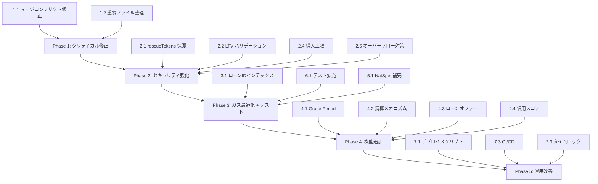

# Decentralized Social Lending — 改善機能仕様書

> **対象コントラクト**: `contracts/decentralizedSocialLending.sol`
> **対象テスト**: `test/SocialLendingWithCollateral.test.js`, `test/BasicTest.js`
> **作成日**: 2026-02-11

---

## 目次

1. [クリティカルバグ修正](#1-クリティカルバグ修正)
2. [セキュリティ強化](#2-セキュリティ強化)
3. [ガス最適化](#3-ガス最適化)
4. [機能追加](#4-機能追加)
5. [コード品質改善](#5-コード品質改善)
6. [テスト拡充](#6-テスト拡充)
7. [インフラ・運用改善](#7-インフラ運用改善)
8. [優先度マトリクス](#8-優先度マトリクス)

---

## 1. クリティカルバグ修正

### 1.1 マージコンフリクトマーカーの残存（**Critical / P0**）

**現状の問題**:
`decentralizedSocialLending.sol` の 485 行目に Git マージコンフリクトマーカー `>>>>>>> main` が残存しており、**コントラクトがコンパイルできない**。また、これにより `getBorrowerLoans` 関数が重複定義されている（447–470行と486–509行）。

**修正仕様**:
- マージコンフリクトマーカー（`>>>>>>> main`）を削除する
- 重複する `getBorrowerLoans` 関数（486–509行）を削除し、447–470行の定義のみを残す
- 484行目のコメント「借り手のローン情報を取得する関数（ガス最適化版）」も重複のため削除する

**検証方法**:
```bash
npx hardhat compile
```

---

### 1.2 未使用 Mock / Interface ファイルの重複（**Low / P2**）

**現状の問題**:
- `contracts/AggregatorV3Interface.sol` と `contracts/interfaces/AggregatorV3Interface.sol` が同じ内容で重複
- `contracts/MockV3Aggregator.sol` と `contracts/mocks/MockPriceFeed.sol` が異なる実装で同じ目的のモック

**修正仕様**:
- `contracts/AggregatorV3Interface.sol` を削除（`contracts/interfaces/` 内のものを正とする）
- `contracts/MockV3Aggregator.sol` を削除（`contracts/mocks/MockPriceFeed.sol` を正とする）
- テストとメインコントラクトの import パスが `contracts/interfaces/AggregatorV3Interface.sol` を参照していることを確認

---

## 2. セキュリティ強化

### 2.1 `rescueTokens` による担保トークン不正引出し防止（**High / P0**）

**現状の問題**:
`rescueTokens(address token, uint256 amount, address to)` は任意のトークンを任意のアドレスに移転でき、**アクティブなローンの担保トークンを管理者が引き出せる**。これは借り手の資産が管理者に横領されるリスクを持つ。

> [!CAUTION]
> Codex レビュー指摘: 全ローンを走査する `_getLockedCollateral` は O(n) でありガスリミットに達するリスクがある。**インクリメンタルな `lockedCollateral` mapping で O(1) 参照に改善**する。

**修正仕様**:

```solidity
// トークンごとのロック中担保量をインクリメンタルに追跡
mapping(address => uint256) public lockedCollateral;
```

**各関数でのロック量更新**:
| 関数 | 更新内容 |
|------|----------|
| `requestLoan` | `lockedCollateral[collateralToken] += collateralAmount` |
| `cancelLoanRequest` | `lockedCollateral[loan.collateralToken] -= loan.collateralAmount` |
| `repayLoan`（全額時）| `lockedCollateral[loan.collateralToken] -= loan.collateralAmount` |
| `declareDefault` | `lockedCollateral[loan.collateralToken] -= loan.collateralAmount` |
| `liquidate` | `lockedCollateral[loan.collateralToken] -= loan.collateralAmount` |

**rescueTokens の改善版（O(1) 参照）**:
```solidity
function rescueTokens(address token, uint256 amount, address to) external onlyOwner {
    if (to == address(0)) revert InvalidAddress();
    
    uint256 contractBalance = IERC20(token).balanceOf(address(this));
    uint256 rescuableAmount = contractBalance - lockedCollateral[token];
    
    if (amount > rescuableAmount) revert InsufficientRescuableBalance();
    
    IERC20(token).safeTransfer(to, amount);
    emit TokensRescued(token, amount, to);
}
```

**追加エラー定義**:
```solidity
error InsufficientRescuableBalance();
```

**追加イベント定義**:
```solidity
event TokensRescued(address indexed token, uint256 amount, address indexed to);
event ETHRescued(uint256 amount, address indexed to);
```

---

### 2.2 LTV 比率の意味定義修正とバリデーション（**High / P1**）

**現状の問題**:
現行コード（L241）の計算式は `requiredCollateralValueInETH = amount * ltvRatio / BASIS_POINTS` であり、`ltvRatio = 5000` のとき「ローン額の50%分の担保が必要」という意味になる。しかし一般的な DeFi では LTV は「担保に対するローンの比率（Loan-to-Value）」を意味する。この不整合がセキュリティ設計を誤らせるリスクがある。

> [!CAUTION]
> 現行の `ltvRatio` は **Collateral-to-Loan 比率** として機能している。名称と実態が逆転しているため、本修正で名称を `collateralRatio` に変更して整合性を確保する。

**修正仕様**:

**方式A（推奨）: 変数名を実態に合わせて修正**
```solidity
// 「必要担保率」として明確化（5000 = ローン額の50%の担保が必要）
uint256 public collateralRatio = 5000;

uint256 public constant MIN_COLLATERAL_RATIO = 10000;  // 最低 100%（担保 ≥ ローン額）
uint256 public constant MAX_COLLATERAL_RATIO = 20000;  // 最大 200%

function setCollateralRatio(uint256 _collateralRatio) external onlyOwner {
    if (_collateralRatio < MIN_COLLATERAL_RATIO || _collateralRatio > MAX_COLLATERAL_RATIO)
        revert InvalidParameter();
    collateralRatio = _collateralRatio;
    emit CollateralRatioUpdated(_collateralRatio);
}
```

**requestLoan 内の担保チェック修正**:
```solidity
// 変更前: requiredCollateral = amount * ltvRatio / BASIS_POINTS
// 変更後: 担保価値 ≥ ローン額 × collateralRatio / BASIS_POINTS
uint256 requiredCollateralValueInETH = amount * collateralRatio / BASIS_POINTS;
if (collateralValueInETH < requiredCollateralValueInETH) revert InsufficientCollateralValue();
```

> [!IMPORTANT]
> デフォルトの `collateralRatio` を `5000`（50%）から `10000`（100%）以上に変更することを強く推奨。50%では担保不足のリスクが高い。

---

### 2.3 管理者関数へのタイムロック導入（**Medium / P1**）

**現状の問題**:
`setPlatformFee`, `setFeeRecipient`, `setLTVRatio`, `setCollateralTokenStatus`, `pause` などの管理者関数は即時反映される。悪意のある管理者やキーの漏洩時に即座に被害が生じる。

**修正仕様**:

> [!CAUTION]
> `operationHash` を外部から受け取る方式はリプレイ攻撃や不正ハッシュ注入のリスクがある。関数内部で `keccak256(abi.encode(functionSelector, params, nonce))` を生成し照合する方式に統一する。

```solidity
uint256 public constant TIMELOCK_DELAY = 48 hours;
uint256 private _timelockNonce;

struct PendingChange {
    bytes32 operationHash;
    uint256 executeAfter;
    bool executed;
}

mapping(bytes32 => PendingChange) public pendingChanges;

event ChangeQueued(bytes32 indexed operationHash, uint256 executeAfter, uint256 nonce);
event ChangeExecuted(bytes32 indexed operationHash);
event ChangeCancelled(bytes32 indexed operationHash);

error ChangeNotQueued();
error TimelockNotExpired();
error ChangeAlreadyExecuted();

/// @notice 変更をキューに追加（ハッシュは内部生成）
/// @param functionSelector 対象関数のセレクタ
/// @param params エンコード済みパラメータ
/// @return operationHash 生成されたオペレーションハッシュ
function queueChange(bytes4 functionSelector, bytes calldata params)
    external onlyOwner returns (bytes32 operationHash)
{
    operationHash = keccak256(abi.encode(functionSelector, params, _timelockNonce++));
    pendingChanges[operationHash] = PendingChange({
        operationHash: operationHash,
        executeAfter: block.timestamp + TIMELOCK_DELAY,
        executed: false
    });
    emit ChangeQueued(operationHash, block.timestamp + TIMELOCK_DELAY, _timelockNonce - 1);
}

/// @dev タイムロック検証・消費を行う internal 関数
function _consumeTimelock(bytes4 functionSelector, bytes memory params) internal {
    // 全 nonce を試行して一致するキュー済みハッシュを探す
    // ※ 実装ではフロントエンドが queueChange の戻り値を保持し、
    //   execute 時に operationHash を渡す方式も可
    bytes32 operationHash = keccak256(abi.encode(functionSelector, params, _timelockNonce - 1));
    PendingChange storage change = pendingChanges[operationHash];
    if (change.executeAfter == 0) revert ChangeNotQueued();
    if (block.timestamp < change.executeAfter) revert TimelockNotExpired();
    if (change.executed) revert ChangeAlreadyExecuted();
    change.executed = true;
    emit ChangeExecuted(operationHash);
}
```

**対象関数**: `setPlatformFee`, `setFeeRecipient`, `setLTVRatio`, `setCollateralTokenStatus`

> [!NOTE]
> `pause()` はタイムロック対象外とする（緊急停止の即時性が必要なため）

---

### 2.4 借入上限・単独ローン最大額の設定（**Medium / P1**）

**現状の問題**:
1件のローン金額に上限が設定されておらず、プラットフォームの流動性リスクが高い。また、1ユーザーあたりの同時借入数にも制限がない。

**修正仕様**:
```solidity
uint256 public maxLoanAmount = 100 ether;           // 1ローンの最大額
uint256 public maxActiveLoansPerBorrower = 5;        // 借り手ごとの同時アクティブ上限

event MaxLoanAmountUpdated(uint256 newMaxAmount);
event MaxActiveLoansPerBorrowerUpdated(uint256 newMax);

function setMaxLoanAmount(uint256 _maxLoanAmount) external onlyOwner {
    if (_maxLoanAmount == 0) revert InvalidParameter();
    maxLoanAmount = _maxLoanAmount;
    emit MaxLoanAmountUpdated(_maxLoanAmount);
}

function setMaxActiveLoansPerBorrower(uint256 _max) external onlyOwner {
    if (_max == 0) revert InvalidParameter();
    maxActiveLoansPerBorrower = _max;
    emit MaxActiveLoansPerBorrowerUpdated(_max);
}
```

`requestLoan` に追加するバリデーション:
```solidity
if (amount > maxLoanAmount) revert InvalidAmount();
if (borrowerActiveLoans[msg.sender] >= maxActiveLoansPerBorrower) revert TooManyActiveLoans();
```

**追加エラー定義**:
```solidity
error TooManyActiveLoans();
```

---

### 2.5 利率計算のオーバーフロー対策強化（**Medium / P1**）

**現状の問題**:
利息計算 `amount * interestRate * duration / SECONDS_PER_YEAR / BASIS_POINTS` は大きな金額・長期間ローンで中間値がオーバーフローする可能性がある（Solidity 0.8 で自動 revert されるが、正当なリクエストが拒否される）。

> [!CAUTION]
> Codex レビュー指摘: `Math.mulDiv(amount * interestRate, ...)` では最初の `amount * interestRate` の乗算自体でオーバーフローし得る。2段階の `mulDiv` に分割する。

**修正仕様**:
```solidity
import "@openzeppelin/contracts/utils/math/Math.sol";

// 2段階 mulDiv で中間値オーバーフローを完全回避
// Step 1: amount × interestRate / BASIS_POINTS（年利相当額を先に計算）
uint256 annualInterest = Math.mulDiv(amount, interestRate, BASIS_POINTS);
// Step 2: 年利相当額 × duration / SECONDS_PER_YEAR（期間按分）
uint256 interestAmount = Math.mulDiv(annualInterest, duration, SECONDS_PER_YEAR);
uint256 repaymentAmount = amount + interestAmount;
```

`duration` の上限チェック追加:
```solidity
uint256 public constant MAX_LOAN_DURATION = 365 days;  // 最大1年

// requestLoan 内:
if (duration > MAX_LOAN_DURATION) revert InvalidDuration();
```

---

## 3. ガス最適化

### 3.1 ユーザー別ローンID管理用インデックスの導入（**High / P1**）

**現状の問題**:
`getBorrowerLoans`, `getLenderLoans`, `getStats` はすべての `loanCount` をイテレーションする O(n) の処理。ローン数が増えると **gas limit を超過して呼び出し不能になる**。

**修正仕様**:

```solidity
// ユーザーごとのローンIDリスト（EnumerableSet または配列）
mapping(address => uint256[]) private _borrowerLoanIds;
mapping(address => uint256[]) private _lenderLoanIds;

// 統計カウンタ（個別変数でインクリメンタルに管理）
uint256 public activeLoansCount;
uint256 public repaidLoansCount;
uint256 public defaultedLoansCount;
uint256 public cancelledLoansCount;
```

**変更が必要な箇所**:
| 関数 | 変更内容 |
|------|---------|
| `requestLoan` | `_borrowerLoanIds[msg.sender].push(loanId)` を追加 |
| `fundLoan` | `_lenderLoanIds[msg.sender].push(loanId)`, `activeLoansCount++` |
| `repayLoan`（全額時）| `activeLoansCount--`, `repaidLoansCount++` |
| `declareDefault` | `activeLoansCount--`, `defaultedLoansCount++` |
| `cancelLoanRequest` | `cancelledLoansCount++` |
| `getBorrowerLoans` | `_borrowerLoanIds[borrower]` からアクティブ状態のみをフィルタして返却（※下記注意） |
| `getLenderLoans` | `_lenderLoanIds[lender]` からアクティブ状態のみをフィルタして返却 |
| `getStats` | カウンタ変数をそのまま返却（O(1)）。`Liquidated` カウンタも追加 |

> [!WARNING]
> Codex レビュー指摘: 現行の `getBorrowerLoans` / `getLenderLoans` は `Requested` または `Funded` 状態のローンのみをフィルタして返す。ID配列を直接返すと完了・キャンセル済みIDも含まれるため、**返却時に `loan.state` をチェックしてフィルタする**か、**状態遷移時に配列から除去する**（ガスコストとのトレードオフ）。推奨は前者（view関数内でフィルタ）。

---

### 3.2 Struct パッキングの最適化（**Low / P2**）

**現状の問題**:
`Loan` 構造体が 11 フィールドで最適なストレージスロットパッキングがされていない。

**修正仕様**:
```solidity
struct Loan {
    // Slot 1: borrower (20 bytes) + state (1 byte) + interestRate (2 bytes, uint16に縮小可能)
    address payable borrower;
    LoanState state;
    uint16 interestRate;    // MAX_INTEREST_RATE = 2000 なので uint16 で十分

    // Slot 2: lender (20 bytes)
    address payable lender;

    // Slot 3
    address collateralToken;

    // Slot 4
    uint256 principalAmount;

    // Slot 5
    uint256 repaymentAmount;

    // Slot 6
    uint256 duration;

    // Slot 7
    uint256 startTime;

    // Slot 8
    uint256 collateralAmount;

    // Slot 9
    uint256 remainingRepaymentAmount;
}
```

> [!IMPORTANT]
> `interestRate` を `uint16` に変更する場合、`requestLoan` のパラメータ型も変更するか、内部で安全にキャストする必要がある。

---

## 4. 機能追加

### 4.1 Grace Period（返済猶予期間）の導入（**High / P1**）

**背景**:
現状では `duration` を超過した瞬間にデフォルト宣言が可能。借り手に返済準備の時間を与える猶予期間が必要。

**修正仕様**:

```solidity
uint256 public gracePeriod = 3 days;  // デフォルトの猶予期間

event GracePeriodUpdated(uint256 newGracePeriod);

function setGracePeriod(uint256 _gracePeriod) external onlyOwner {
    if (_gracePeriod > 30 days) revert InvalidParameter();
    gracePeriod = _gracePeriod;
    emit GracePeriodUpdated(_gracePeriod);
}
```

`declareDefault` / `checkAndDeclareDefault` の条件変更:
```solidity
// 変更前:
if (block.timestamp <= loan.startTime + loan.duration) revert LoanNotExpired();

// 変更後:
if (block.timestamp <= loan.startTime + loan.duration + gracePeriod) revert LoanNotExpired();
```

---

### 4.2 清算メカニズム（Liquidation）の導入（**High / P1**）

**背景**:
現状のデフォルト処理は期日超過のみが条件。担保価値がローン残高を下回った場合の清算メカニズムがなく、貸し手が損失を被るリスクが高い。

> [!IMPORTANT]
> Codex レビュー指摘: (a) 清算を `LoanState.Repaid` に遷移させると統計・信用スコアが誤計上される → **`Liquidated` 状態を新設**する。(b) `liquidationBonus` を定義しながら実装で未使用だった → ボーナス分の担保計算を実装し、余剰担保は借り手に返却する。

**前提: LoanState enum の拡張**:
```solidity
enum LoanState { Requested, Funded, Repaid, Defaulted, Cancelled, Liquidated }
```

**修正仕様**:

```solidity
uint256 public liquidationThreshold = 12000;  // 120%（担保率がこれを下回ると清算可能）
uint256 public liquidationBonus = 500;         // 5%（清算者へのインセンティブ）

event LoanLiquidated(
    uint256 indexed loanId,
    address indexed liquidator,
    uint256 collateralSeized,
    uint256 collateralReturnedToBorrower,
    uint256 debtRepaid
);
event LiquidationThresholdUpdated(uint256 newThreshold);

error CollateralSufficient();
error NoDebtToLiquidate();

/// @notice 担保率不足のローンを清算する
/// @dev 清算者は債務を肩代わりし、債務相当 + ボーナス分の担保を受け取る。
///      余剰担保は借り手に返却される。
function liquidate(uint256 loanId)
    external
    payable
    nonReentrant
    validLoanId(loanId)
    whenNotPaused
{
    Loan storage loan = loans[loanId];
    if (loan.state != LoanState.Funded) revert InvalidLoanState();
    if (loan.remainingRepaymentAmount == 0) revert NoDebtToLiquidate();

    // 現在の担保率を確認
    uint256 collateralValue = getCollateralValueInETH(
        loan.collateralToken, loan.collateralAmount
    );
    uint256 ratio = collateralValue * BASIS_POINTS / loan.remainingRepaymentAmount;
    if (ratio >= liquidationThreshold) revert CollateralSufficient();

    // 清算者が借入残高を支払う
    if (msg.value < loan.remainingRepaymentAmount) revert InvalidAmount();

    uint256 excessETH = msg.value - loan.remainingRepaymentAmount;
    uint256 debtRepaid = loan.remainingRepaymentAmount;

    // 清算者が受け取る担保量を計算（債務相当額 + ボーナス分）
    // seizeValue = debt * (BASIS_POINTS + liquidationBonus) / BASIS_POINTS
    uint256 seizeValue = debtRepaid * (BASIS_POINTS + liquidationBonus) / BASIS_POINTS;
    // seizeValue を担保トークン量に逆算（collateralValue : collateralAmount の比率）
    uint256 seizeAmount;
    if (seizeValue >= collateralValue) {
        seizeAmount = loan.collateralAmount; // 担保全額
    } else {
        seizeAmount = loan.collateralAmount * seizeValue / collateralValue;
    }
    uint256 surplusCollateral = loan.collateralAmount - seizeAmount;

    // 状態変更（Liquidated 状態に遷移 — Repaid とは区別）
    loan.remainingRepaymentAmount = 0;
    loan.state = LoanState.Liquidated;
    borrowerActiveLoans[loan.borrower]--;
    lenderActiveLoans[loan.lender]--;

    // 貸し手に返済金を送金
    loan.lender.sendValue(debtRepaid);

    // 清算者にボーナス込み担保を移転
    IERC20(loan.collateralToken).safeTransfer(msg.sender, seizeAmount);

    // 余剰担保を借り手に返却
    if (surplusCollateral > 0) {
        IERC20(loan.collateralToken).safeTransfer(loan.borrower, surplusCollateral);
    }

    // 余剰ETHを返却
    if (excessETH > 0) {
        payable(msg.sender).sendValue(excessETH);
    }

    emit LoanLiquidated(loanId, msg.sender, seizeAmount, surplusCollateral, debtRepaid);
}
```

---

### 4.3 ローンオファー機能（貸し手主導のマッチング）（**Medium / P2**）

**背景**:
現状は借り手がリクエスト → 貸し手がファンドの一方向フロー。貸し手が条件を提示して借り手を待つ逆フローを導入し、流動性を向上させる。

**修正仕様**:

```solidity
/// @dev オファーの状態遷移: Created → Accepted / Cancelled / Expired
enum OfferState { Created, Accepted, Cancelled, Expired }

struct LoanOffer {
    address payable lender;
    uint256 principalAmount;
    uint256 maxInterestRate;    // 受け入れる最大利率
    uint256 minDuration;        // 最小期間
    uint256 maxDuration;        // 最大期間
    address requiredCollateralToken;  // 指定担保トークン（address(0) なら任意）
    uint256 minCollateralRatio; // 要求する最小担保率
    OfferState state;
    uint256 createdAt;
    uint256 expiresAt;          // オファー有効期限
}

mapping(uint256 => LoanOffer) public loanOffers;
uint256 public offerCount;

event LoanOfferCreated(
    uint256 indexed offerId,
    address indexed lender,
    uint256 amount,
    uint256 maxInterestRate
);
event LoanOfferAccepted(
    uint256 indexed offerId,
    uint256 indexed loanId,
    address indexed borrower
);
event LoanOfferCancelled(uint256 indexed offerId);
event LoanOfferExpired(uint256 indexed offerId);

error OfferExpired();
error OfferNotExpired();

/// @notice 貸し手がローンオファーを作成
function createLoanOffer(
    uint256 maxInterestRate,
    uint256 minDuration,
    uint256 maxDuration,
    address requiredCollateralToken,
    uint256 minCollateralRatio
) external payable nonReentrant whenNotPaused {
    if (msg.value == 0) revert InvalidAmount();
    if (maxInterestRate == 0 || maxInterestRate > MAX_INTEREST_RATE) revert InvalidInterestRate();
    if (maxDuration == 0 || maxDuration > MAX_LOAN_DURATION) revert InvalidDuration();
    if (minDuration > maxDuration) revert InvalidDuration();

    uint256 offerId = offerCount++;
    loanOffers[offerId] = LoanOffer({
        lender: payable(msg.sender),
        principalAmount: msg.value,
        maxInterestRate: maxInterestRate,
        minDuration: minDuration,
        maxDuration: maxDuration,
        requiredCollateralToken: requiredCollateralToken,
        minCollateralRatio: minCollateralRatio,
        state: OfferState.Created,
        createdAt: block.timestamp,
        expiresAt: block.timestamp + 30 days  // デフォルト30日間有効
    });

    emit LoanOfferCreated(offerId, msg.sender, msg.value, maxInterestRate);
}

/// @notice 貸し手がオファーをキャンセルしETHを回収
function cancelLoanOffer(uint256 offerId) external nonReentrant {
    LoanOffer storage offer = loanOffers[offerId];
    if (msg.sender != offer.lender) revert Unauthorized();
    if (offer.state != OfferState.Created) revert InvalidLoanState();

    offer.state = OfferState.Cancelled;
    payable(msg.sender).sendValue(offer.principalAmount);
    emit LoanOfferCancelled(offerId);
}

/// @notice 借り手がオファーを受け入れてローンを作成
function acceptLoanOffer(
    uint256 offerId,
    uint256 interestRate,
    uint256 duration,
    address collateralToken,
    uint256 collateralAmount
) external nonReentrant whenNotPaused {
    LoanOffer storage offer = loanOffers[offerId];
    if (offer.state != OfferState.Created) revert InvalidLoanState();
    if (block.timestamp > offer.expiresAt) {
        offer.state = OfferState.Expired;
        revert OfferExpired();
    }
    if (msg.sender == offer.lender) revert SelfFunding();
    if (interestRate > offer.maxInterestRate) revert InvalidInterestRate();
    if (duration < offer.minDuration || duration > offer.maxDuration) revert InvalidDuration();
    if (offer.requiredCollateralToken != address(0) &&
        collateralToken != offer.requiredCollateralToken) revert TokenNotAllowed();

    // 担保バリデーション（requestLoan と同様のロジック）
    if (collateralAmount == 0) revert InvalidCollateral();
    if (collateralToken == address(0)) revert InvalidAddress();
    if (!allowedCollateralTokens[collateralToken]) revert TokenNotAllowed();
    uint256 collateralValueInETH = getCollateralValueInETH(collateralToken, collateralAmount);
    uint256 requiredCollateralValueInETH = offer.principalAmount * collateralRatio / BASIS_POINTS;
    if (collateralValueInETH < requiredCollateralValueInETH) revert InsufficientCollateralValue();

    // 担保デポジット
    IERC20(collateralToken).safeTransferFrom(msg.sender, address(this), collateralAmount);
    lockedCollateral[collateralToken] += collateralAmount;

    // オファー状態更新
    offer.state = OfferState.Accepted;

    // ローン作成（Funded 状態で直接作成）
    uint256 loanId = loanCount++;
    uint256 annualInterest = Math.mulDiv(offer.principalAmount, interestRate, BASIS_POINTS);
    uint256 interestAmount = Math.mulDiv(annualInterest, duration, SECONDS_PER_YEAR);
    uint256 repaymentAmount = offer.principalAmount + interestAmount;

    loans[loanId] = Loan({
        borrower: payable(msg.sender),
        lender: offer.lender,
        principalAmount: offer.principalAmount,
        interestRate: interestRate,
        repaymentAmount: repaymentAmount,
        duration: duration,
        startTime: block.timestamp,
        state: LoanState.Funded,
        collateralToken: collateralToken,
        collateralAmount: collateralAmount,
        remainingRepaymentAmount: repaymentAmount
    });

    borrowerActiveLoans[msg.sender]++;
    lenderActiveLoans[offer.lender]++;
    activeLoansCount++;

    // プラットフォーム手数料を控除して借り手に送金
    uint256 feeAmount = offer.principalAmount * platformFee / BASIS_POINTS;
    uint256 amountToBorrower = offer.principalAmount - feeAmount;
    payable(feeRecipient).sendValue(feeAmount);
    payable(msg.sender).sendValue(amountToBorrower);

    emit LoanOfferAccepted(offerId, loanId, msg.sender);
}

/// @notice 期限切れオファーのETHを貸し手に返却（誰でも実行可）
function expireLoanOffer(uint256 offerId) external nonReentrant {
    LoanOffer storage offer = loanOffers[offerId];
    if (offer.state != OfferState.Created) revert InvalidLoanState();
    if (block.timestamp <= offer.expiresAt) revert OfferNotExpired();

    offer.state = OfferState.Expired;
    offer.lender.sendValue(offer.principalAmount);
    emit LoanOfferExpired(offerId);
}
```

---

### 4.4 信用スコアシステム（Social Credit Score）（**Medium / P2**）

**背景**:
プロジェクト名 "Social Lending" に対応する社会的信用機能がない。返済履歴に基づく信用スコアを導入する。

**修正仕様**:

```solidity
struct UserReputation {
    uint256 totalLoans;             // 総ローン数
    uint256 repaidLoans;            // 完済数
    uint256 defaultedLoans;         // デフォルト数
    uint256 totalBorrowedAmount;    // 総借入額
    uint256 totalRepaidAmount;      // 総返済額
    uint256 lastActivityTimestamp;  // 最終活動日時
}

mapping(address => UserReputation) public userReputations;

event ReputationUpdated(address indexed user, uint256 totalLoans, uint256 repaidLoans, uint256 defaultedLoans);

/// @notice ユーザーの信用スコアを算出（0–10000 ベーシスポイント）
/// @dev 完済率 × 重みA + アクティビティ × 重みB をベースに計算
function getCreditScore(address user) external view returns (uint256 score) {
    UserReputation storage rep = userReputations[user];
    if (rep.totalLoans == 0) return 5000; // 新規ユーザーはニュートラル

    uint256 repaymentRatio = rep.repaidLoans * BASIS_POINTS / rep.totalLoans;
    uint256 volumeBonus = 0;
    if (rep.totalRepaidAmount > 10 ether) volumeBonus = 500;
    if (rep.totalRepaidAmount > 100 ether) volumeBonus = 1000;

    score = repaymentRatio + volumeBonus;
    if (score > BASIS_POINTS) score = BASIS_POINTS;
}
```

**更新タイミング**:
- `repayLoan`（全額返済時）: `repaidLoans++`, `totalRepaidAmount += amount`
- `declareDefault` / `checkAndDeclareDefault`: `defaultedLoans++`
- `requestLoan`: `totalLoans++`, `totalBorrowedAmount += amount`

---

### 4.5 複数担保トークン対応ローン（**Low / P3**）

**背景**:
現状は 1 ローンにつき 1 種類の担保トークンのみ。複数トークンを担保として組み合わせる機能をサポートする。

**修正仕様**:

```solidity
struct CollateralItem {
    address token;
    uint256 amount;
}

// Loan 構造体を変更（collateralToken, collateralAmount を配列に）
// mapping(uint256 => CollateralItem[]) public loanCollaterals;
```

> [!WARNING]
> この変更は Loan 構造体の大幅な変更を伴うため、他の改善を先に実装した後に検討する。

---

## 5. コード品質改善

### 5.1 NatSpec ドキュメントの完全補完（**Medium / P1**）

**現状の問題**:
一部の関数のみに NatSpec コメントが付与されている。管理者専用関数（`setPlatformFee`, `setFeeRecipient`, `setLTVRatio`, `rescueTokens`, `rescueETH`）や view 関数にはコメントがない。

**修正仕様**:
すべての `external` / `public` 関数に以下を付与:
- `@notice` — 関数の概要
- `@param` — 各パラメータの説明
- `@return` — 戻り値の説明（該当する場合）
- `@dev` — 実装の注意点（該当する場合）

---

### 5.2 コメント言語の統一（**Low / P3**）

**現状の問題**:
日本語コメント（`// 定数`, `// 緊急時にトークンを回収する関数（管理者用）`）と英語 NatSpec コメントが混在。

**修正仕様**:
すべてのコメントを英語に統一。NatSpec format（`@notice`, `@param` 等）を使用。

---

### 5.3 カスタムエラーへのパラメータ付与（**Low / P2**）

**現状の問題**:
`InvalidAmount()`, `InvalidLoanState()` 等のカスタムエラーにコンテキスト情報がない。デバッグ時に具体的な原因が分からない。

**修正仕様**:
```solidity
error InvalidAmount(uint256 provided, uint256 expected);
error InvalidLoanState(uint256 loanId, LoanState currentState, LoanState expectedState);
error InsufficientCollateralValue(uint256 provided, uint256 required);
error IncorrectFundingAmount(uint256 provided, uint256 expected);
error StaleData(uint256 updatedAt, uint256 threshold);
```

---

### 5.4 pragma solidity バージョンの固定（**Low / P2**）

**現状の問題**:
`pragma solidity ^0.8.0;` はバージョン範囲が広すぎる。Hardhat config では `0.8.24` を指定しているが、コントラクト側の制約が弱い。

**修正仕様**:
```solidity
pragma solidity 0.8.24;
```

---

## 6. テスト拡充

### 6.1 テストカバレッジの改善方針（**High / P1**）

**現状の不足箇所**:

| カテゴリ | 不足しているテスト |
|---------|-------------------|
| Pause/Unpause | pause 中の全関数呼び出し拒否テスト |
| アクセス制御 | 非オーナーによる管理者関数呼び出し拒否テスト |
| `cancelLoanRequest` | 存在しないローンID, 他ユーザーのローン, Funded以降のキャンセル |
| `repayLoan` | 超過支払い時の余剰返金テスト, 0 ETH送金 |
| `checkAndDeclareDefault` | 第三者によるデフォルト宣言, 部分返済後のデフォルト |
| `rescueTokens/ETH` | 実行テスト、非オーナー拒否テスト |
| 価格フィード | Stale data テスト, 負の価格テスト（既存だが不完全）|
| ガス測定 | ローン数増加時の `getBorrowerLoans` / `getStats` のガス消費量測定 |
| Edge cases | `loanCount` が 0 の時の view 関数, `maxInterestRate` 境界値 |

**追加テスト仕様**:

```javascript
describe("Pause/Unpause", function () {
    it("pause中はrequestLoanが失敗すること", async function () { ... });
    it("pause中はfundLoanが失敗すること", async function () { ... });
    it("pause中はrepayLoanが失敗すること", async function () { ... });
    it("非オーナーはpauseできないこと", async function () { ... });
    it("unpause後に全機能が復帰すること", async function () { ... });
});

describe("アクセス制御", function () {
    it("非オーナーがsetPlatformFeeを呼べないこと", async function () { ... });
    it("非オーナーがsetFeeRecipientを呼べないこと", async function () { ... });
    it("非オーナーがsetLTVRatioを呼べないこと", async function () { ... });
    it("非借り手がcancelLoanRequestを呼べないこと", async function () { ... });
    it("非貸し手がdeclareDefaultを呼べないこと", async function () { ... });
});

describe("ローンキャンセル", function () {
    it("Requested状態のローンをキャンセルできること", async function () { ... });
    it("Funded状態のローンはキャンセルできないこと", async function () { ... });
    it("キャンセル後に担保が返却されること", async function () { ... });
});

describe("統計・View関数", function () {
    it("getStatsが正確な統計を返すこと", async function () { ... });
    it("getBorrowerLoansがアクティブローンのみを返すこと", async function () { ... });
    it("getLenderLoansが正確なリストを返すこと", async function () { ... });
    it("getCollateralizationRatioが正確な比率を返すこと", async function () { ... });
});

describe("Edge Cases", function () {
    it("MAX_INTEREST_RATE境界値でローンが作成できること", async function () { ... });
    it("最大duration境界値でローンが作成できること", async function () { ... });
    it("超過支払い時に余剰分が返却されること", async function () { ... });
});

describe("清算メカニズム", function () {
    it("担保率が閾値以下のとき清算できること", async function () { ... });
    it("担保率が十分なとき清算が拒否されること", async function () { ... });
    it("清算者にボーナス込み担保が移転されること", async function () { ... });
    it("余剰担保が借り手に返却されること", async function () { ... });
    it("清算後の状態がLiquidatedであること", async function () { ... });
});

describe("タイムロック", function () {
    it("タイムロック前の変更が拒否されること", async function () { ... });
    it("タイムロック後の変更が成功すること", async function () { ... });
    it("同じ変更の二重実行が拒否されること", async function () { ... });
});

describe("rescueTokens 担保保護", function () {
    it("ロック中担保を超えるrescueが拒否されること", async function () { ... });
    it("ロックされていないトークンはrescueできること", async function () { ... });
});

describe("担保率バリデーション", function () {
    it("MIN_COLLATERAL_RATIO未満の設定が拒否されること", async function () { ... });
    it("MAX_COLLATERAL_RATIO超過の設定が拒否されること", async function () { ... });
});

describe("Grace Period", function () {
    it("猶予期間内のデフォルト宣言が拒否されること", async function () { ... });
    it("猶予期間終了後にデフォルト宣言が成功すること", async function () { ... });
});

describe("ローンオファー", function () {
    it("オファー作成が正常に動作すること", async function () { ... });
    it("オファー受入でローンがFunded状態で作成されること", async function () { ... });
    it("キャンセルでETHが貸し手に返却されること", async function () { ... });
    it("期限切れオファーの受入が拒否されること", async function () { ... });
    it("期限切れ後にETHが返却されること", async function () { ... });
});

describe("信用スコア", function () {
    it("新規ユーザーのスコアが5000であること", async function () { ... });
    it("完済後にスコアが上昇すること", async function () { ... });
    it("デフォルト後にスコアが低下すること", async function () { ... });
});
```

---

### 6.2 Solidity Coverage 目標（**Medium / P1**）

**目標カバレッジ率**:
- Statements: ≥ 95%
- Branches: ≥ 90%
- Functions: 100%
- Lines: ≥ 95%

**実行コマンド**:
```bash
npx hardhat coverage
```

---

## 7. インフラ・運用改善

### 7.1 デプロイスクリプトの追加（**Medium / P1**）

**現状の問題**:
デプロイスクリプトが存在しない。

**修正仕様**:
`scripts/deploy.ts` を新規作成:

```typescript
import { ethers } from "hardhat";

async function main() {
    const [deployer] = await ethers.getSigners();
    console.log("Deploying with:", deployer.address);

    const feeRecipient = process.env.FEE_RECIPIENT || deployer.address;

    const SocialLending = await ethers.getContractFactory("SocialLendingWithCollateral");
    const lending = await SocialLending.deploy(feeRecipient);
    await lending.waitForDeployment();

    console.log("SocialLendingWithCollateral deployed to:", await lending.getAddress());

    // 初期設定（環境変数から読み込み）
    // await lending.setCollateralTokenStatus(tokenAddress, true);
    // await lending.setPriceFeed(tokenAddress, priceFeedAddress);
}

main().catch((error) => {
    console.error(error);
    process.exitCode = 1;
});
```

---

### 7.2 Hardhat ネットワーク設定の拡充（**Low / P2**）

**修正仕様**:
`hardhat.config.ts` に Sepolia テストネット設定を追加:

```typescript
networks: {
    hardhat: { chainId: 31337 },
    sepolia: {
        url: process.env.SEPOLIA_RPC_URL || "",
        accounts: process.env.PRIVATE_KEY ? [process.env.PRIVATE_KEY] : [],
        chainId: 11155111,
    },
},
etherscan: {
    apiKey: process.env.ETHERSCAN_API_KEY || "",
},
```

---

### 7.3 CI/CD パイプラインの追加（**Medium / P2**）

**修正仕様**:
`.github/workflows/ci.yml` を新規作成:

```yaml
name: CI
on: [push, pull_request]

jobs:
  test:
    runs-on: ubuntu-latest
    steps:
      - uses: actions/checkout@v4
      - uses: actions/setup-node@v4
        with:
          node-version: '20'
          cache: 'npm'
      - run: npm ci
      - run: npx hardhat compile
      - run: npx hardhat test
      - run: npx hardhat coverage
      - name: Check coverage thresholds
        run: |
          node -e "
            const coverage = require('./coverage.json');
            // カバレッジ閾値チェック
          "
```

---

### 7.4 `.env.example` の追加（**Low / P3**）

```env
# Network
SEPOLIA_RPC_URL=https://eth-sepolia.g.alchemy.com/v2/YOUR_KEY
PRIVATE_KEY=your_private_key_here

# Etherscan
ETHERSCAN_API_KEY=your_etherscan_api_key

# Contract Configuration
FEE_RECIPIENT=0x...

# Gas Reporter
REPORT_GAS=true
```

---

## 8. 優先度マトリクス

| 優先度 | ID | 改善項目 | カテゴリ | 影響度 | 工数 |
|--------|-----|---------|---------|--------|------|
| **P0** | 1.1 | マージコンフリクト修正 | バグ修正 | 🔴 Critical | 極小 |
| **P0** | 2.1 | rescueTokens 担保保護 | セキュリティ | 🔴 Critical | 小 |
| **P1** | 2.2 | LTV比率バリデーション | セキュリティ | 🟡 High | 極小 |
| **P1** | 2.4 | 借入上限設定 | セキュリティ | 🟡 High | 小 |
| **P1** | 2.5 | 利率計算オーバーフロー対策 | セキュリティ | 🟡 High | 小 |
| **P1** | 3.1 | ユーザー別ローンIDインデックス | ガス最適化 | 🟡 High | 中 |
| **P1** | 4.1 | Grace Period 導入 | 機能追加 | 🟡 High | 小 |
| **P1** | 4.2 | 清算メカニズム | 機能追加 | 🟡 High | 中 |
| **P1** | 5.1 | NatSpec 完全補完 | コード品質 | 🟡 Medium | 小 |
| **P1** | 6.1 | テストカバレッジ改善 | テスト | 🟡 High | 中 |
| **P1** | 6.2 | Coverage 目標設定 | テスト | 🟡 Medium | 小 |
| **P1** | 7.1 | デプロイスクリプト | インフラ | 🟡 Medium | 小 |
| **P1** | 2.3 | タイムロック導入 | セキュリティ | 🟡 Medium | 中 |
| **P2** | 1.2 | 重複ファイル整理 | バグ修正 | 🟢 Low | 極小 |
| **P2** | 3.2 | Struct パッキング | ガス最適化 | 🟢 Low | 小 |
| **P2** | 4.3 | ローンオファー機能 | 機能追加 | 🟡 Medium | 大 |
| **P2** | 4.4 | 信用スコアシステム | 機能追加 | 🟡 Medium | 大 |
| **P2** | 5.3 | カスタムエラーパラメータ | コード品質 | 🟢 Low | 小 |
| **P2** | 5.4 | pragma バージョン固定 | コード品質 | 🟢 Low | 極小 |
| **P2** | 7.2 | ネットワーク設定拡充 | インフラ | 🟢 Low | 極小 |
| **P2** | 7.3 | CI/CD パイプライン | インフラ | 🟡 Medium | 小 |
| **P3** | 4.5 | 複数担保トークン対応 | 機能追加 | 🟢 Low | 大 |
| **P3** | 5.2 | コメント言語統一 | コード品質 | 🟢 Low | 小 |
| **P3** | 7.4 | .env.example 追加 | インフラ | 🟢 Low | 極小 |

---

## 推奨実装順序



---

> **備考**: 本仕様書は `prompt/improve.md` の既存改善提案を包含し、より具体的な実装仕様に落とし込んだものです。各改善項目は独立して実装・テスト可能な単位で分割されています。
